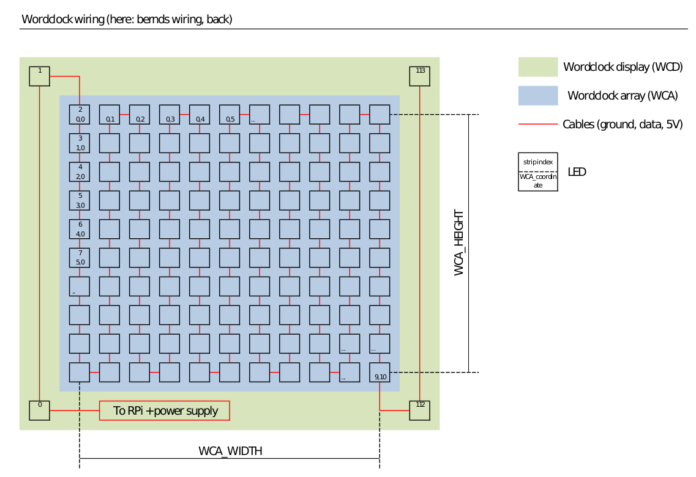

Concepts
========

* WCA (Word Clock Array): The center matrix, without minute-LEDs and other stuff
* WCA_WIDTH, WCA_HEIGHT: Height and width of the WCA.

  * Part of the wordclock software are png-files, which need to fit to these values.
  * Currently available: 11x10 png-files.
  * Support for wordclocks with other resolution available (untested).

* WCD (Word Clock Display): Includes any led attached to the wordclock (such as minutes, possible/future ambilights/etc.)
* Coordinates (or: WCA-coordinates): Can be 1d or 2d, used to adress a LED on the word clock array
* Index (or: strip index): Used to adress a LED depending on the position on the LED-strip

... To be expanded to explain further important concepts within this library.

