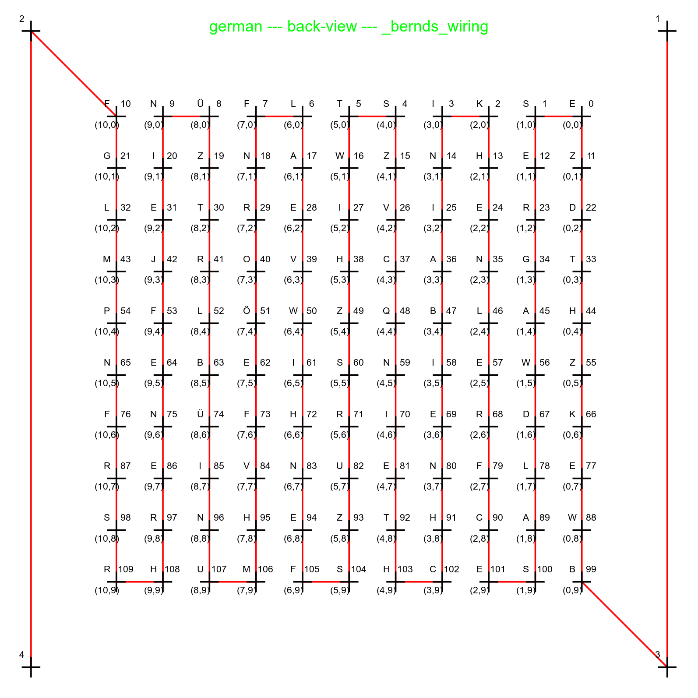
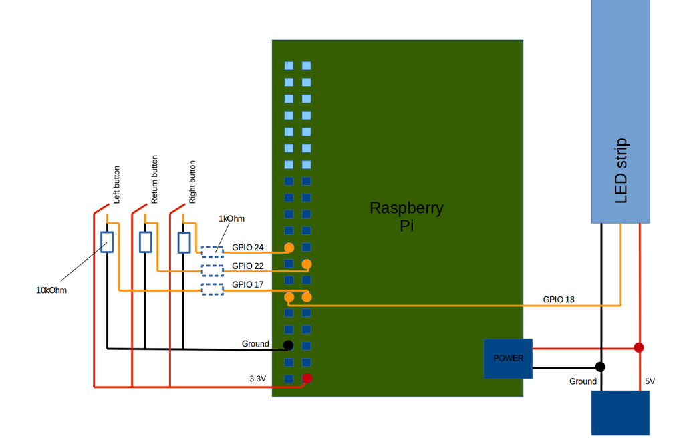

.. _concepts:
Concepts
========

.. _concept_WCA:
* WCA (Word Clock Array): The center matrix, without minute-LEDs and other stuff
.. _concept_WCA_DIMENSION:
* WCA_WIDTH, WCA_HEIGHT: Height and width of the WCA.

  * Part of the wordclock software are png-files, which need to fit to these values.
  * Currently available: 11x10 png-files.
  * Support for wordclocks with other resolution available (untested).

.. _concept_WCD:
* WCD (Word Clock Display): Includes any led attached to the wordclock (such as minutes, possible/future ambilights/etc.)
.. _concept_coordinate:
* Coordinates (or: WCA-coordinates): Can be 1d or 2d, used to adress a LED on the word clock array
.. _concept_index:
* Index (or: strip index): Used to adress a LED depending on the position on the LED-strip

.. _exemplary_wiring:
.. _concept_exemplary_wiring_layout:
Exemplary display wiring
++++++++++++++++++++++++

Exemplary wiring layout (backside of bernds_wiring, WCA_WIDTH*WCA_HEIGHT=11*10, WCA=Word Clock Array)

.. figure:: _images/wiring_front_bernds_wiring.png
    :scale: 40 %
    :alt: Examplary wiring layout (front side)

.. _exemplary_button_wiring:
Exemplary button wiring
++++++++++++++++++++++++

Exemplary wiring layout to connect RPi, buttons, etc.

