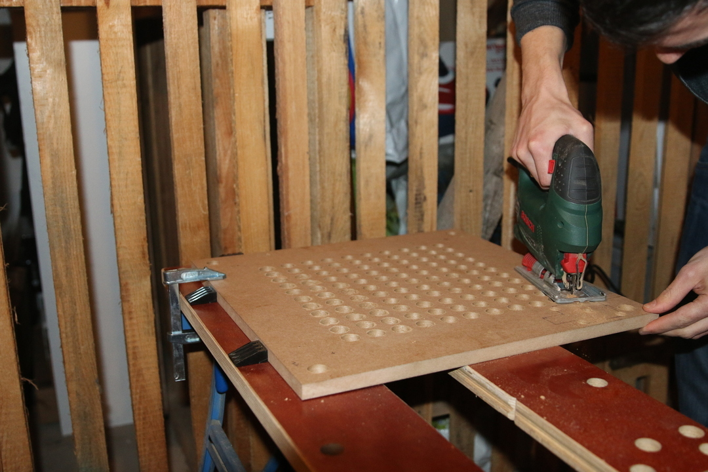
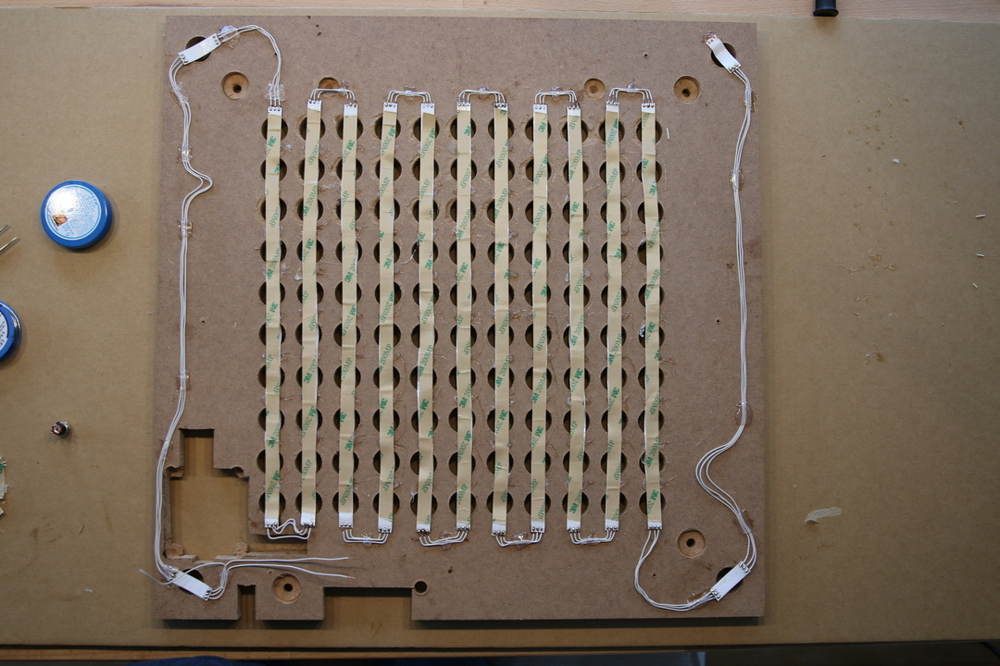
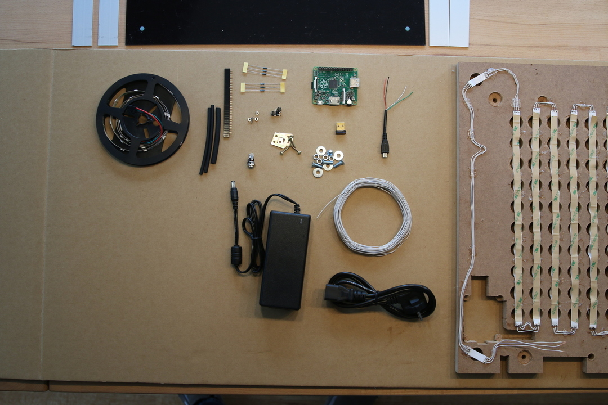
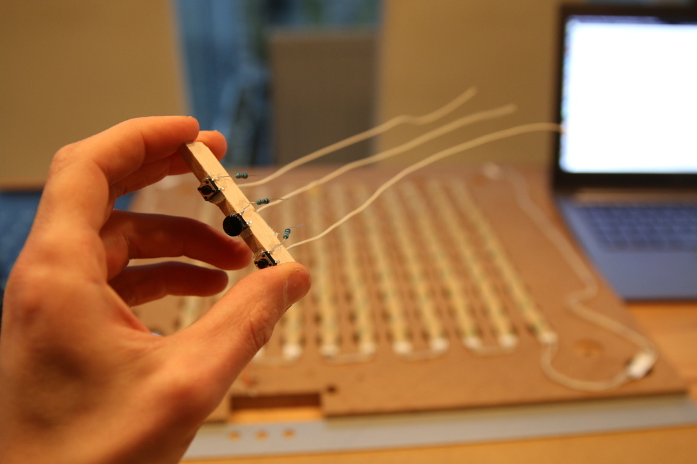
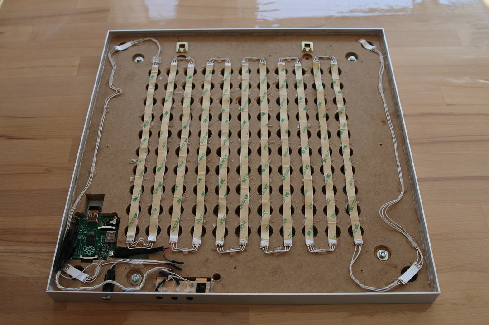

.. _hardware_setup:
Hardware setup
==============

.. _hardware_setup_steps:
Assembling steps
++++++++++++++++

.. figure:: _images/drilling.jpg
    :scale: 40%
    :alt: Drilling

.. figure:: _images/software_update.jpg
    :scale: 40%
    :alt: Software Update

.. figure:: _images/wiring_detail.jpg
    :scale: 40%
    :alt: Wiring detail

.. figure:: _images/final_backside_detail.jpg
    :scale: 40%
    :alt: Final backside detail

.. _video_documentation:
Video documentation on the wiring layout
++++++++++++++++++++++++++++++++++++++++

`Link to wiring documentation <http://youtu.be/V9TwvranJnY?t=8m43s>`_
