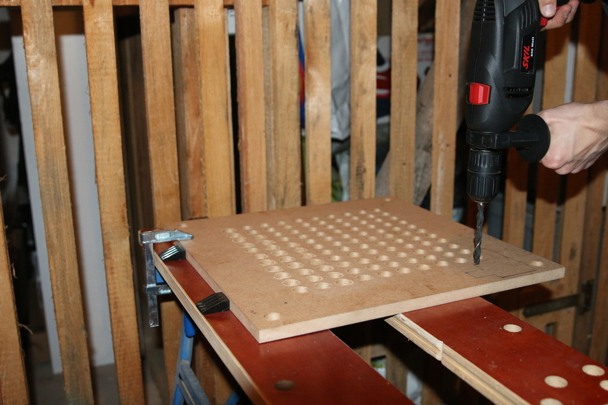
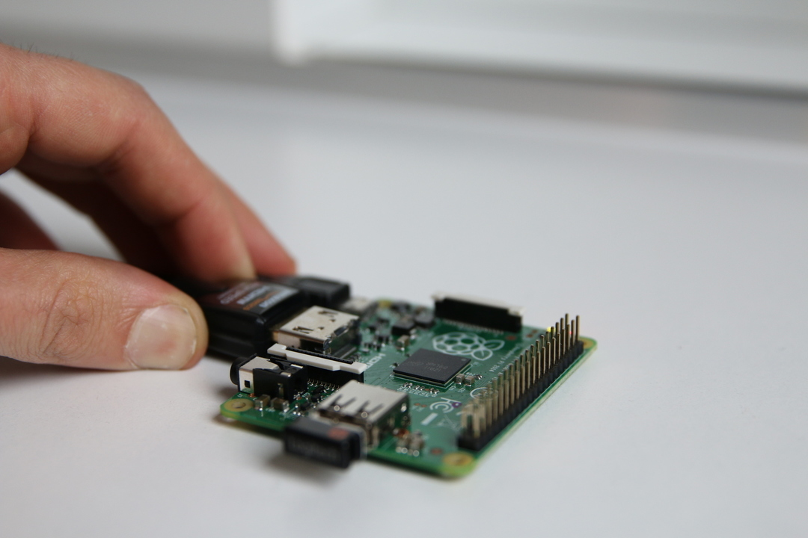
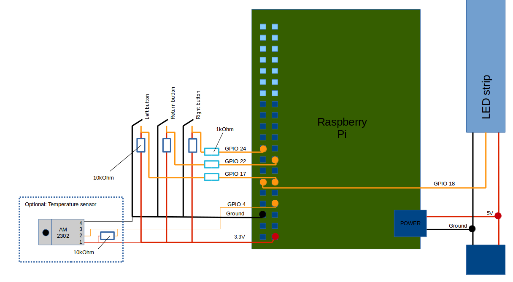
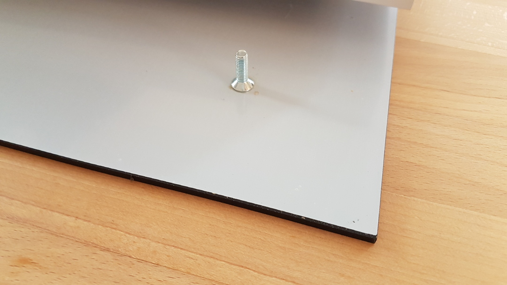
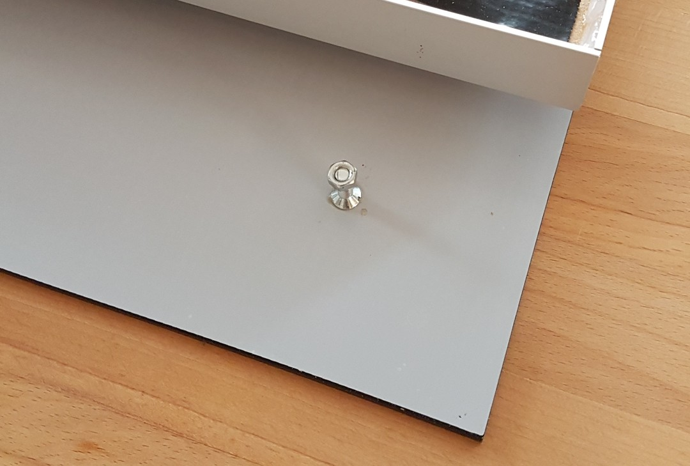
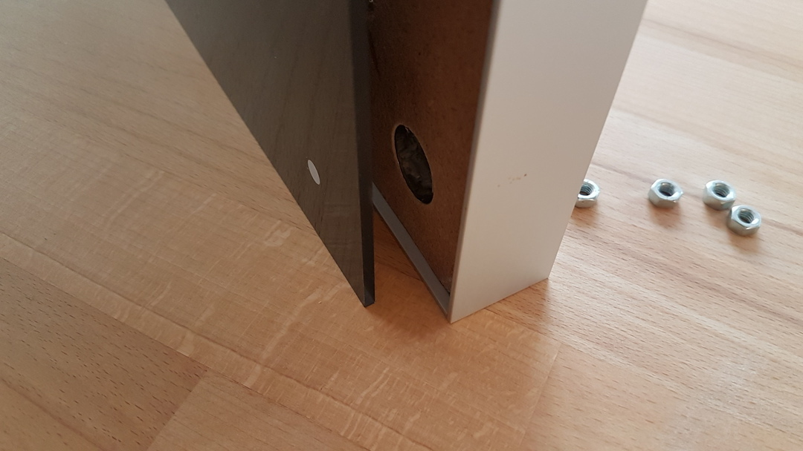
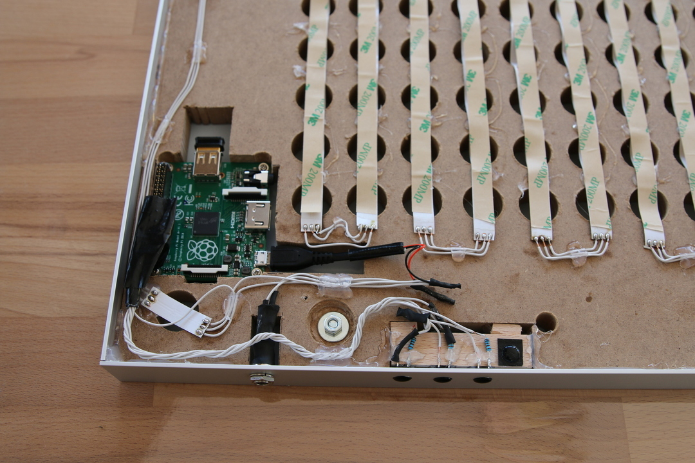

.. _hardware_setup:
.. _hardware_setup_steps:
Hardware setup
==============

.. _skeleton_setup:
Skeleton setup
++++++++++++++

    According to the stencil layout, for each LED a hole needs to be prepared. The total number of 114 holes makes this pretty tedious.

.. figure:: _images/sawing.jpg
    :scale: 40%
    :alt: Sawing

    To place the Raspberry Pi within the skeleton, some sawing is required...

.. _led_setup:
LED setup
+++++++++

.. figure:: _images/after_soldering.jpg
    :scale: 40%
    :alt: After Soldering

    After soldering the LED strip, the clock looks like this. The soldering needs to be done according to the wiring layout. E.g. based on 11*10 letters:

.. _exemplary_wiring:
.. _concept_exemplary_wiring_layout:

.. figure:: _images/wiring_front_bernds_wiring.png
    :scale: 25 %
    :alt: Examplary wiring layout (front side)

    Further wiring layouts are `available <https://github.com/bk1285/rpi_wordclock/tree/master/wordclock_layouts>`_. Assure to connect the LED strip in the right direction. Little arrows indicate that along the strip.

.. _rpi_setup:
Raspberry Pi setup
++++++++++++++++++

    Before you mount your raspberry inside the clock, install the latest Raspbian, connect it to your local wifi and ensure that you can ssh to it.

.. _button_setup:
Button setup
++++++++++++

.. figure:: _images/components.jpg
    :scale: 40%
    :alt: Components

    At this stage, the displayed components are required for the further setup.

    Conceptual wiring layout to connect RPi, buttons, etc. See also `Power connectors <https://en.wikipedia.org/wiki/Coaxial_power_connector>`_, `USB-Pinouts <https://en.wikipedia.org/wiki/USB#Pinouts>`_

.. figure:: _images/wiring_detail.jpg
    :scale: 40%
    :alt: Wiring detail

    The connection of buttons, LED strip and power brings the wordclock close to its final hardware configuration.

.. _exemplary_button_wiring:

.. figure:: _images/wiring_button.jpg
    :scale: 40%
    :alt: Wiring button

    Buttons with attached resistors. The center button has already its final tip.

.. _stancil_setup:
Stancil setup
+++++++++++++

    Fixation of 4 screws within the 4 corners of the stancil using two-component adhesive.

    Allows to fix the stancil with screw-nuts to the sceleton.

    To increase stability, consider an overlapping of the frame to hold the major weight of the stancil.

.. _final_clock:
Final clock
+++++++++++

.. figure:: _images/final_backside.jpg
    :scale: 40%
    :alt: Final backside

    Backside of the final wordclock.

    Closeup of the final wordclock.

.. _video_documentation:
Video documentation on the wiring layout
++++++++++++++++++++++++++++++++++++++++

`Link to wiring documentation <http://youtu.be/V9TwvranJnY?t=8m43s>`_
